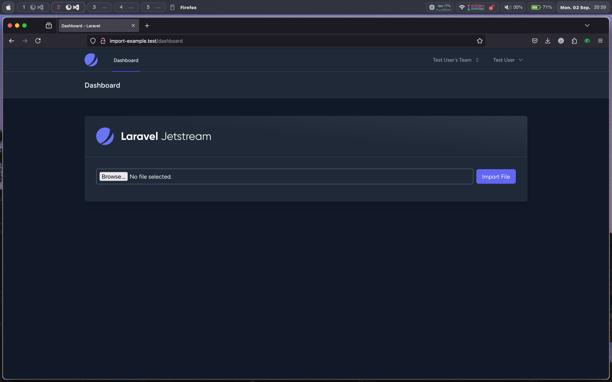

## TLDR

1. Gunakan laravel excel untuk import file excel.
2. Saat file diunggah, simpan file ke storage dan impor melalui queue, kirim user notifikasi setelah selesai atau terjadi kesalahan.
3. Gunakan websocket untuk mengirim informasi progress ke Frontend
4. Frontend menyimpan progress ke _localStorage_ secara berkala untuk mengetahui progress terakhir saat user mengalami kendala koneksi internet

## Informasi Singkat

Berikut informasi singkat terkait **package** yang digunakan

### Tech Stack

Saya asumsikan pembaca telah familiar dengan hal - hal yang digunakan berikut.

- PHP v8.3
- Laravel v11.x
- Tailwind v3
- Laravel Reverb
- Laravel Excel v3.1
- Laravel Jetsream  v5.x (Stack inertia + vue)

### Data pendukung
Berikut data pendukung yang akan digunakan untuk simulasi impor file excel dengan queue dan progres bar

[File excel]()

## Instalasi

Berikut opsi - opsi yang saya pilih saat membuat project dengan laravel dan laravel jetsream (stack inertia + vue)


Lanjut, instal laravel excel

```bash
composer require maatwebsite/excel
```

publish config dengan perintah

```bash
php artisan vendor:publish --provider="Maatwebsite\Excel\ExcelServiceProvider" --tag=config
```

Instal laravel reverb

```bash
php artisan install:broadcasting
```

Buat table queue

```bash
php artisan queue:table
```

Migrate dan seed

```bash
php artisan migrate --seed
```

Ok, kita telah berhasil melakukan instalasi **package - package** yang dibutuhkan, mari mulai memasak 🧑‍🍳

## Antar Muka Pengguna

Kita akan mulai dengan membuat antar muka pengguna, buka file `resources/js/Components/Welcome.vue`

```vue title="Welcome.vue" add={2,3,6,8,9,10}
<script setup>
import { onMounted, ref } from "vue";
import { useForm } from "@inertiajs/vue3";
import ApplicationLogo from "@/Components/ApplicationLogo.vue";

const inputFile = ref();

const form = useForm({
    file: null,
});
</script>
```

Sesuaikan `script` yang ada menjadi seperti potongan kode dibawah ini

```vue title="Dashboard.vue"
<template>
    <div>
        <div
            class="p-6 lg:p-8 bg-white dark:bg-gray-800 dark:bg-gradient-to-bl dark:from-gray-700/50 dark:via-transparent border-b border-gray-200 dark:border-gray-700"
        >
            <ApplicationLogo class="block h-12 w-auto" />
        </div>

        <div class="p-6 lg:p-8">
            <div class="relative overflow-x-auto">
                <div class="mb-4 w-full flex flex-row space-x-2 items-center">
                    <div class="w-full">
                        <input
                            type="file"
                            ref="inputFile"
                            @change="form.file = $event.target.files[0]"
                            class="w-full bg-transparent border border-slate-500 p-2 rounded-md text-white"
                        />
                    </div>
                    <div class="w-max">
                        <button
                            class="w-max cursor-pointer py-2 px-4 bg-indigo-500 capitalize rounded-md text-white"
                        >
                            import file
                        </button>
                    </div>
                </div>
            </div>
        </div>
    </div>
</template>
```

Jika sudah sesuai, form akan terlihat seperti pada gambar dibawah ini



## Unggah File

Selanjutnya buat controller dengan argument `--invokable` karena kita hanya butuh satu fungsi untuk meng-handle file yang diunggah

```bash
php artisan make:controller UserImportController --invokable
```

Daftarkan routing kita didalam middleware `jetstream.auth_session`

```php title="web.php" add={3}
Route::middleware(['auth:sanctum', config('jetstream.auth_session'), 'verified'])->group(function () {
    Route::get('/dashboard',  fn() => Inertia::render('Dashboard'))->name('dashboard');
    Route::post('user-import', App\Http\Controllers\UserImportController::class)->name('user-import');
});
```

Lanjutkan dengan membuat fungsi untuk meng-handle file yang diunggah

Sesuaikan file `UserImportController.php` yang tadi seperti pada potongan kode dibawah ini

```php title="UserImportController.php" add={3-5,7-12}
public function __invoke(Request $request)
{
    $request->validate([
        'file' => ['required', 'file'],
    ]);

    try {
        $file = $request->file('file')->store('users');
        return back();
    } catch (\Throwable $th) {
        return back()->with(['error' => $th->getMessage()]);
    }
}
```

Sekarang kembali ke file `Welcome.vue` untuk buat fungsi unggah file ke server

```js title="Welcome.vue" add={1-8}
const submit = () => {
    form.post(route("user-import"), {
        onSuccess: () => {
            form.reset();
            inputFile.value.value = null;
        },
    });
};
```

Tambahkan juga fungsi `submit` pada tombol import file

```vue title="Welcome.vue" add={2}
<button
    @click="submit"
    class="w-max cursor-pointer py-2 px-4 bg-indigo-500 capitalize rounded-md text-white"
>
    import file
</button>
```

Sekarang kita sudah bisa mengunggah file ke server. Lanjut dengan membuat file impor

## Impor

```bash
php artisan make:import UserImport
```

Buka dan sesuaikan file `UserImport.php`

```php title="UserImport.php" add={7-12,15} del={14,17-23}
<?php

namespace App\Imports;

use Illuminate\Support\Collection;
use Maatwebsite\Excel\Concerns\ToCollection;
use App\Models\User;
use Illuminate\Support\Str;
use App\Events\UserImportProgress;
use Illuminate\Support\Facades\Hash;
use Maatwebsite\Excel\Concerns\ToModel;
use Illuminate\Contracts\Queue\ShouldQueue;

class UserImport implements ToCollection
class UserImport implements ToModel, ShouldQueue
{
    /**
    * @param Collection $collection
    */
    public function collection(Collection $collection)
    {
        //
    }
}
```

Ubah menggunakan `method` model karena kita meng-implementasi-kan `interface` `ToModel`

```php title="UserImport.php" add={1-15}
public function model(array $row)
{
    $name = $row[1];
    $email = strtolower($name) . '@test.com';

    $user = new User([
        'name' => $name,
        'email' => $email,
        'password' => Hash::make($name),
    ]);

    return $user;
}
```
