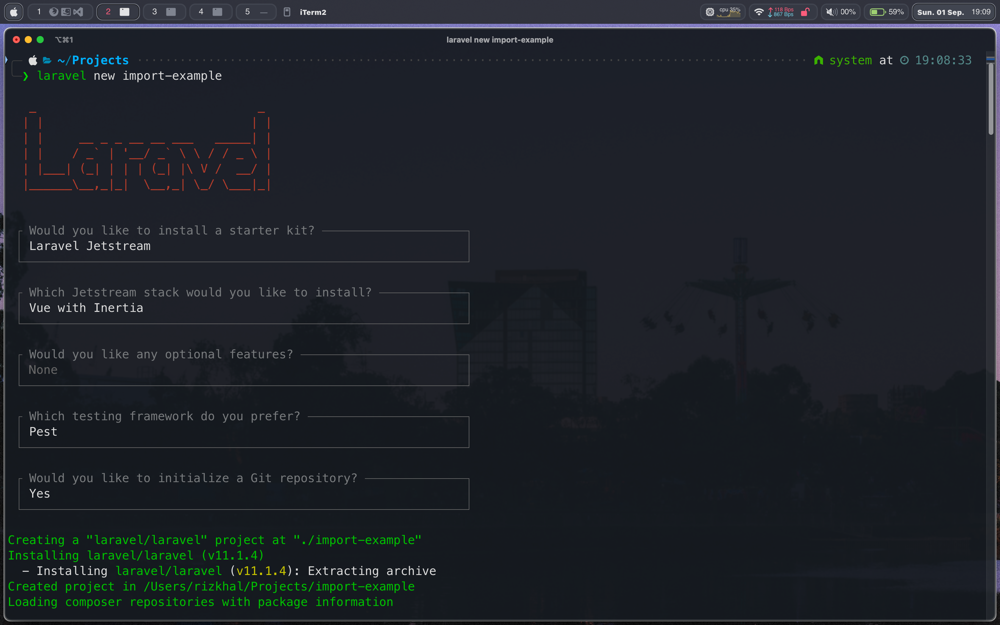

## TLDR

1. Gunakan laravel excel untuk import file excel.
2. Saat file diunggah, simpan file ke storage dan impor melalui queue, kirim user notifikasi setelah selesai atau terjadi kesalahan.
3. Gunakan websocket untuk mengirim informasi progress ke Frontend
4. Frontend menyimpan progress ke _localStorage_ secara berkala untuk mengetahui progress terakhir saat user mengalami kendala koneksi internet

## Informasi Singkat

Berikut informasi singkat terkait **package** yang digunakan

- PHP v8.3
- Laravel v11.x
- Tailwind v3
- Laravel Reverb
- Laravel Excel v3.1
- Laravel Jetsream  v5.x (Stack inertia + vue)

Saya asumsikan pembaca telah familiar dengan hal - hal yang digunakan diatas.

## Instalasi

Berikut opsi - opsi yang saya pilih saat membuat project dengan laravel dan laravel jetsream (stack inertia + vue)



Lanjut, instal laravel excel

```bash
composer require maatwebsite/excel
```

publish config dengan perintah

```bash
php artisan vendor:publish --provider="Maatwebsite\Excel\ExcelServiceProvider" --tag=config
```

Instal laravel reverb

```bash
php artisan install:broadcasting
```

Buat table queue

```bash
php artisan queue:table
```

Migrate dan seed

```bash
php artisan migrate --seed
```

Ok, kita telah berhasil melakukan instalasi **package - package** yang dibutuhkan, mari mulai memasak 🧑‍🍳

## Antar Muka Pengguna

Kita akan mulai dengan membuat antar muka pengguna, buka file `resources/js/Components/Welcome.vue`

Import dan buat property untuk model

```vue title="Welcome.vue" add={2,3,6,8,9,10}
<script setup>
import { onMounted, ref } from "vue";
import { useForm } from "@inertiajs/vue3";
import ApplicationLogo from "@/Components/ApplicationLogo.vue";

const inputFile = ref();

const form = useForm({
    file: null,
});
</script>
```

Buat form

```vue title="Dashboard.vue"
<template>
    <div>
        <div
            class="p-6 lg:p-8 bg-white dark:bg-gray-800 dark:bg-gradient-to-bl dark:from-gray-700/50 dark:via-transparent border-b border-gray-200 dark:border-gray-700"
        >
            <ApplicationLogo class="block h-12 w-auto" />
        </div>

        <div class="p-6 lg:p-8">
            <div class="relative overflow-x-auto">
                <div class="mb-4 w-full flex flex-row space-x-2 items-center">
                    <div class="w-full">
                        <input
                            type="file"
                            ref="inputFile"
                            @change="form.file = $event.target.files[0]"
                            class="w-full bg-transparent border border-slate-500 p-2 rounded-md text-white"
                        />
                    </div>
                    <div class="w-max">
                        <button
                            class="w-max cursor-pointer py-2 px-4 bg-indigo-500 capitalize rounded-md text-white"
                        >
                            import file
                        </button>
                    </div>
                </div>
            </div>
        </div>
    </div>
</template>
```