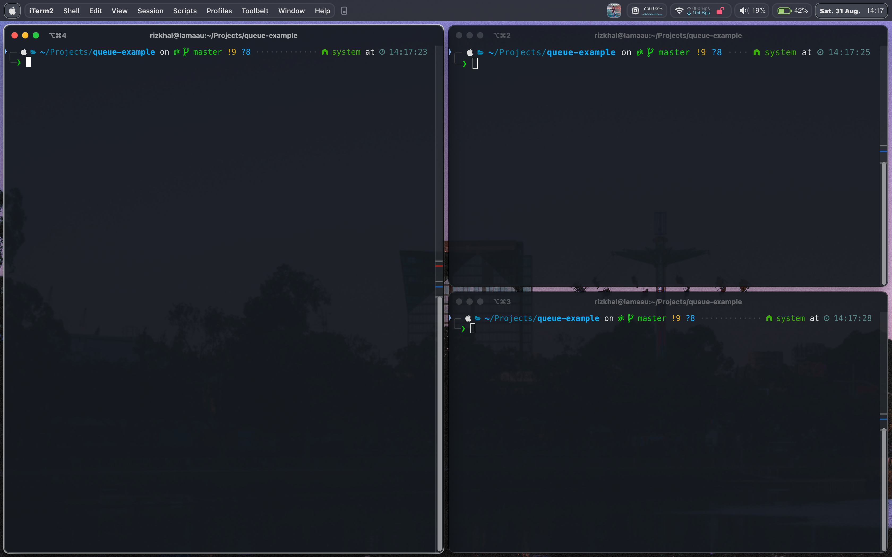
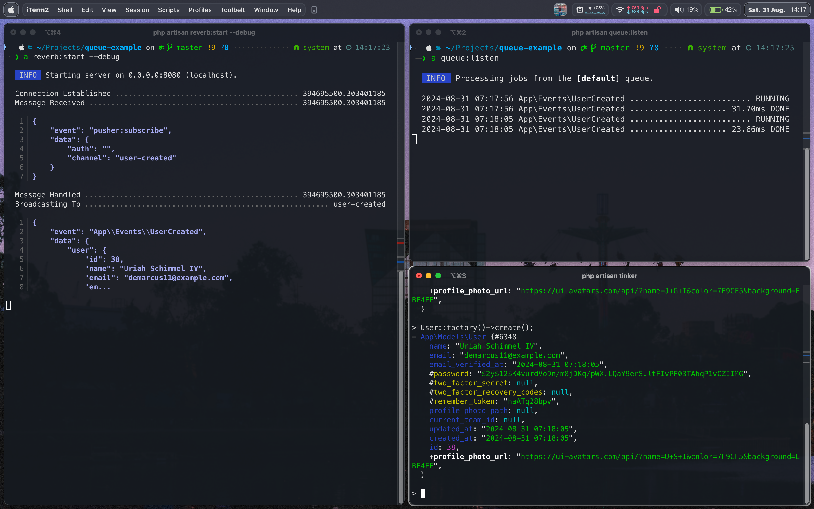
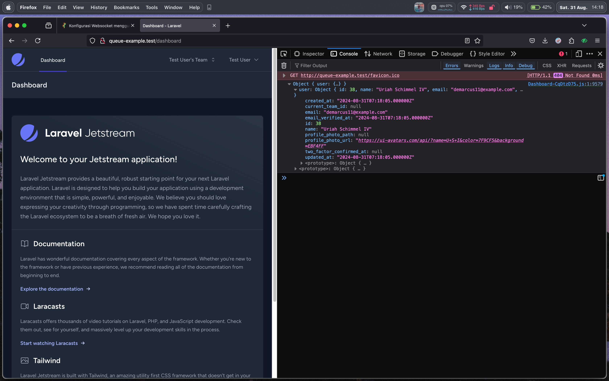

Laravel Reverb adalah _official package_ dari laravel untuk membuat komunikasi _Real Time_ antara _Client_ dan _Server_.

Pada tulisan kali ini kita akan belajar bagaimana membuat koneksi sederhana antara client dan server.

Hal - hal yang akan kita pelajari antara lain

- Instalasi Reverb

    Environment variable pada package reverb dan penggunaan package laravel-echo

- Konfigurasi Event

    Fungsional channel dan contoh kasus penggunaan channel yang ideal

<br />

## Instalasi
Saya menggunakan versi terbaru dari Laravel, saat saya menulis ini versi terakhir dari laravel adalah versi **11.x**.

Saya juga menggunakan laravel jetstream starterkit dengan inertia sebagai proxy antara frontend dan backend

Buat project baru

```bash
composer create-project laravel/laravel example-app
```

Buat migrations queue
```bash
php artisan queue:table
```

Migrate

```bash
php artisan migrate
```

Silahkan masuk ke directory aplikasi anda dan lakukan instalasi reverb

```bash
php artisan install:broadcasting
```

Yang terjadi setelah perintah diatas dieksekusi adalah

- Publish file config broadcasting dan route channels
- Melakukan installasi Laravel Reverb (Websocket Server)
- Instal dan build package nodejs terkait

<br />

:::note
Anda dapat membuat whitelist host yang dapat terkoneksi dengan websocket pada file `config/reverb.php` dengan menambahkan daftar host pada attribute `allowed_origins`.
:::

<br />

Selanjutnya periksa konfigurasi pada file `.env`, akan terjadi beberapa perubahan, antara lain

```bash title=".env"
BROADCAST_CONNECTION=reverb
...

REVERB_APP_ID=133726
REVERB_APP_KEY=lkfpiln8hdukfcmtu8vm
REVERB_APP_SECRET=ntslrlitqt0tdouenrjp
REVERB_HOST="localhost"
REVERB_PORT=8080
REVERB_SCHEME=http

VITE_REVERB_APP_KEY="${REVERB_APP_KEY}"
VITE_REVERB_HOST="${REVERB_HOST}"
VITE_REVERB_PORT="${REVERB_PORT}"
VITE_REVERB_SCHEME="${REVERB_SCHEME}"
```

Satu lagi yang ditambahkan oleh perintah diatas adalah file `resources/js/echo.js`

```javascript title="echo.js"
import Echo from 'laravel-echo';
import Pusher from 'pusher-js';

window.Pusher = Pusher;

window.Echo = new Echo({
    broadcaster: 'reverb',
    key: import.meta.env.VITE_REVERB_APP_KEY,
    wsHost: import.meta.env.VITE_REVERB_HOST,
    wsPort: import.meta.env.VITE_REVERB_PORT ?? 80,
    wssPort: import.meta.env.VITE_REVERB_PORT ?? 443,
    forceTLS: (import.meta.env.VITE_REVERB_SCHEME ?? 'https') === 'https',
    enabledTransports: ['ws', 'wss'],
});
```

File echo menulis konfigurasi untuk menghubungkan antara Client dan Server, file echo ini kemudian di-import kedalam file bootstrap.js sehingga object Echo dapat diakses dari semua file javascript dan vue
<br />

## Konfigurasi Event

Buat event baru

```bash
php artisan make:event UserCreated
```

Di laravel sendiri terdapat 3 (tiga) channel, berikut perbedaan dan contoh kasus yang tepat untuk digunakan

- Fungsional
    - **Public Channel**: Digunakan untuk public dengan atau tanpa autentikasi

    - **Private Channel**: Digunakan untuk user yang ter-autentikasi

    - **Presence Channel**: Digunakan untuk user yang ter-autentikasi, juga memberikan informasi seperti akun siapa saja yang terkoneksi (presence information)

- Contoh Kasus
    - **Public Channel**: Notifikasi informasi publik, realtime statistics counter atau live score

    - **Private Channel**: Notifikasi spesifik ke user yang ter-autentikasi

    - **Presence Channel**: Realtime collaboration, grup chat atau memberikan informasi pengguna yang sedang aktif secara realtime

Lanjut, buka file `app/Events/UserCreated.php` dan ubah channel yang digunakan.

```php title="UserCreated.php" ins={2,7} del={1,4,5,6}
public function broadcastOn(): array
public function broadcastOn(): Channel
{
    return [
        new PrivateChannel('channel-name'),
    ];
    return new Channel('user-created');
}
```

Selanjutnya, daftarkan event yang telah dibuat untuk men-trigger broadcasting.

Karena pada contoh kali ini kita menggunakan Public Channel dengan event UserCreated, maka event ini akan ditriger saat ada user baru yang membuat atau dibuatkan akun.

<br />

:::note
Anda dapat menggunakan observer, event listener, booted method pada model dan atau cara lainnya untuk mendaftarkan event
:::

<br />

Selanjutnya tambahkan property `$dispatchesEvents` pada file `app/Models/User.php` seperti pada potongan kode dibawah

```php title="User.php"
protected $dispatchesEvents = [
    'created' => \App\Events\UserCreated::class,
];
```

Karena saya mendaftarkan event ini pada model `User.php` dengan _magic property $dispatchesEvents_ - nya laravel, maka secara default user yang baru ter-created nantinya akan di-passing sebagai argument.

Agar user yang ter-created dikirim ke frontend menggunakan websocket, buka kembali file `app/Events/UserCreated.php` dan tambahkan paremeter `User $user` yang akan kita terima dari default _lifecycle hook_ - nya laravel.

```php title="UserCreated.php"
public function __construct(
    public User $user,
) {
    //
}
```

Sekarang user yang ter-created dapat diterima di frontend dengan bantuan package laravel-echo.

Selanjutnya buka file `Dashboard.vue` dan tambahkan potongan kode dibawah ini untuk melihat _event_ yang dikirim dari backend.

```javascript title="Dasbhoard.vue"
window.Echo.channel("user-created").listen("UserCreated", (event) => {
    console.log(event);
});
```

Argument dalam fungsi channel `(user-created)` adalah argument yang sama dalam method `broadcastOn` pada file `app/Events/UserCreated.php` dan argument dalam fungsi listen `(UserCreated)` adalah nama file event yang kita buat sebelumnya.

<br />

## Uji Coba Websocket

Build frontend dengan perintah

```bash
yarn build
```

Selanjutnya  buka 3 (tiga) terminal untuk menjalankan 3 (tiga) perintah yang berbeda



- **Terminal 1**: `php artisan reverb:start --debug`

    Untuk menjalankan websocket server dengan argument `--debug` untuk melihat log setiap kali ada trigger dari server

- **Terminal 2**: `php artisan queue:listen`

    Untuk mejalankan queue

- **Terminal 3**: `php artisan tinker`

    Untuk melakukan simulasi jika ada user membuat akun. Gunakan perintah `User::factory()->create()` untuk membuat akun


Saat tinker di-trigger, queue dijalankan di-background dan mengeksekusi event `UserCreated` dan mengirim sinyal ke frontend bahwa ada user yang baru dibuat



Kemudian secara realtime menampilkan di-log browser data user yang kita kirim dari backend, object user itu datang dari parameter `User $user` pada _constructor_ file `UserCreated`



<br />

## Video Demo

<iframe width="560" height="315" src="https://www.youtube.com/embed/EyrqOBxlb3M" frameborder="0" allow="accelerometer; autoplay; clipboard-write; encrypted-media; gyroscope; picture-in-picture" allowfullscreen></iframe>